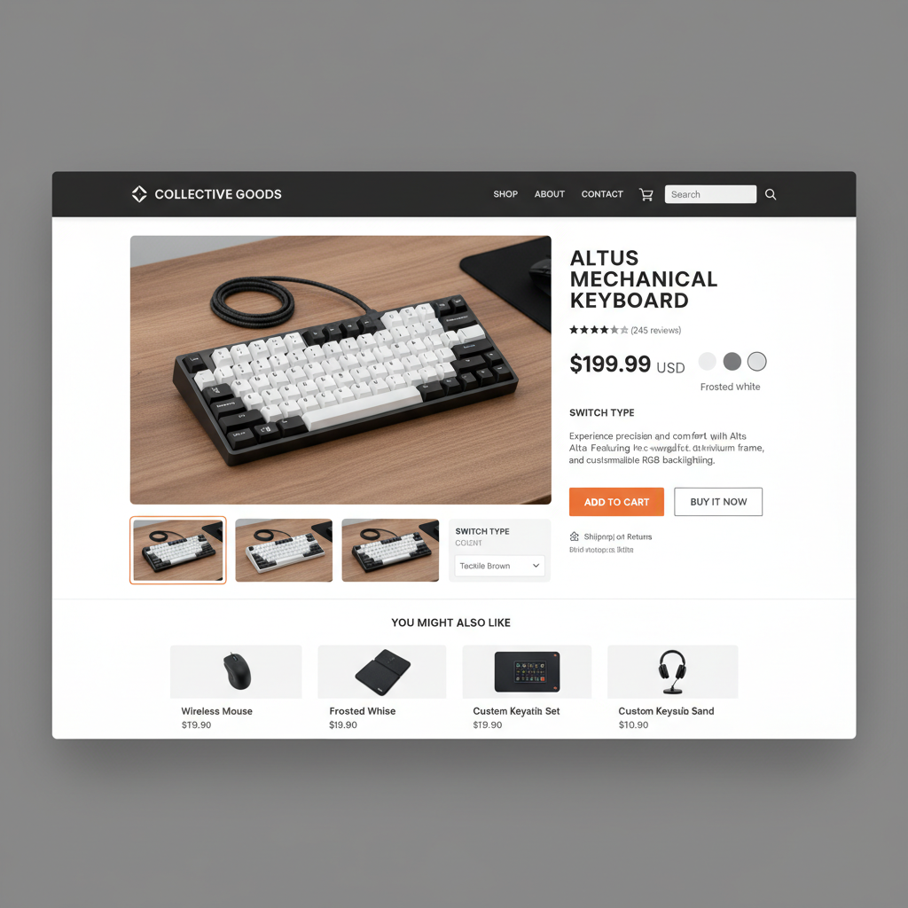

# Esercizio 6: Mini e-Commerce - Layout e Stile Frontend

## Obiettivo
Progetta una pagina prodotto di un piccolo e-commerce, concentrandoti su layout, stile e usabilità.

## Specifiche
- Crea una pagina con almeno:
  - Immagine del prodotto (placeholder)
  - Titolo prodotto
  - Descrizione breve
  - Prezzo ben evidenziato
  - Pulsante “Aggiungi al carrello” con effetto hover e transizione
  - Sezione evidenziata con caratteristiche o varianti (es. taglie, colori) con layout a griglia o flexbox
- Aggiungi un header semplice con logo e menu (home, prodotti, carrello)
- Footer minimal con info contatti e link social
- Usa media query per rendere la pagina leggibile e ben disposta su desktop, tablet e smartphone
- Add bonus: effetto animato sul pulsante o immagine al passaggio del mouse

## Suggerimenti tecnici
- Usa Flexbox o Grid per il layout responsive
- Sfrutta variabili CSS per i colori principali e i font
- Inserisci transizioni e hover per rendere interattiva l’interfaccia
- Cura margini, padding e spaziatura per migliorare la leggibilità

---
## Bonus (facoltativo)
- Aggiungi una barra di navigazione “fissa” in cima alla pagina
- Implementa tooltip CSS per mostrare info aggiuntive quando si passa sopra un elemento
- Usa pseudo-classi per evidenziare il pulsante quando è attivo o selezionato

